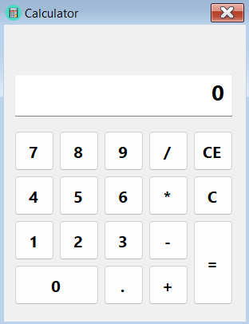

# WinForms-Digital-Clock
A calculator app developed in Windows Forms.



## Installation
- Clone the source code:

```
git clone https://github.com/aydindogukan/WinForms-Calculator
```

- Open the `WinForms-Calculator.sln` file in Visual Studio.
- Run the source code.